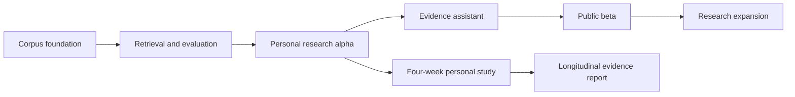

# ML Research Copilot — Roadmap and Reading Guide

Date: 2026-09-05. Status: design and plans prepared for review; application implementation has not started.

The project is aimed at a machine learning engineer role in retrieval and recommendation. The first user is the developer; the intended broader audience is researchers who explore topics, find related work and keep up with papers.

## Read in this order

1. [Technical specification](specs/2026-09-05-ml-research-copilot-design.md): product scope, architecture, schemas, ranking formulas, APIs, evaluation, operations and assumptions.
2. The six milestone plans below: exact file ownership, interfaces, regression examples, implementation logic, acceptance cases and evidence to collect.
3. [Progress tracker](progress.md): task status, gates, evidence links and decisions.

The specification is the shared source of truth. All future code paths in the plans are relative to this repository. There is currently no application code. Test and deployment commands in the plans are instructions for implementation, not checks already executed.

## Milestones and dependencies

| Milestone | Deliverable | Tasks | Exit checkpoint | Plan |
|---|---|---|---|---|
| M1 | Replayable accepted-paper corpus | P1.1–P1.5 | G1: replay, identity, parser audit, export/restore | [Corpus foundation](plans/2026-09-05-01-corpus-foundation.md) |
| M2 | Measured search and ranking API | P2.1–P2.5 | G2: four baselines, stable indexes, quality/latency decision | [Retrieval and ranking](plans/2026-09-05-02-retrieval-ranking.md) |
| M3 | Search/library/feed with feedback | P3.1–P3.5 | G3: workflow journeys, personalization, offline evaluation | [Recommendation workspace](plans/2026-09-05-03-recommendation-workspace.md) |
| M4 | Cited chat, PDF and image QA | P4.1–P4.5 | G4: provenance/support audit, private upload lifecycle | [Evidence assistant](plans/2026-09-05-04-evidence-assistant.md) |
| M5 | Deployed beta with recovery and limits | P5.1–P5.5 | G5: isolation, load, restore, reproducible case study | [Production beta](plans/2026-09-05-05-production-beta.md) |
| M6 | Wider corpus and advanced ML experiments | P6.1–P6.5 | G6: completed measured experiments, promote/retain decision | [Research expansion](plans/2026-09-05-06-research-expansion.md) |

M1–M5 are the portfolio MVP. M3 already offers all three research-discovery workflows. M6 is optional expansion.

A personal study can run while M4 and M5 are built. Building its instrumentation is a completed engineering task; collecting four weeks of observations is a separate progress checkpoint. No user feedback or research result is presumed.

## Changes from the proposal, and why

- Start evaluation and experiment manifests before tuning retrieval. The final ranking story needs a trustworthy comparison.
- Bring recommendations and feedback forward, before rich chat, to match the stated role focus and begin collecting personal signals.
- Keep all three discovery workflows: topic query, seed-paper related search and ongoing personalized feed.
- Start corpus ingestion at 100 papers, then 1k, then verified venue-year releases. Scale metadata and full text independently when needed.
- Use a modular app and durable PostgreSQL worker initially. Redis/Celery and broader agent orchestration remain justified by measurements.
- Preserve the distinction between public papers and private uploads throughout database, index, export and deletion paths.
- Treat hierarchical retrieval, reranking and learned ranking as hypotheses to evaluate; retain a simpler baseline if it performs better.
- Treat single-user recommendation results as personal evidence; external-researcher validation requires an actual pilot.

## Estimated effort and planning assumptions

These are planning estimates, not commitments. They assume one developer learning parts of the stack, using hosted generation and accessible paper sources, with no existing implementation.

| Work | Focused engineering hours |
|---|---:|
| M1 corpus | 45–75 |
| M2 retrieval and benchmark harness | 55–90 |
| M3 recommendation workspace | 60–100 |
| M4 evidence and uploads | 60–100 |
| M5 production beta | 40–65 |
| MVP engineering subtotal | 260–430 |
| Human labeling, parser audit, experiment interpretation | 40–80 additional |
| Approximate total with 25% contingency | 375–640 |
| Optional M6 expansion | 100–200 additional, strongly data-dependent |

At 15 focused hours/week, the MVP estimate is roughly 25–43 weeks; at 30 hours/week, roughly 13–22 weeks. External access, corpus downloads, GPU provisioning and recruiting may add calendar time. Replace estimates with actual throughput after M1. Do not commit to a launch date before measuring the first vertical slice.

If available time is tighter, the first useful and career-relevant release is M3: evaluated search, personal recommendation and a working web UI. Rich multimodal chat can follow without weakening the retrieval/recommendation story.

## Working rhythm and definition of done

For each task:

1. Read its interfaces and the linked spec sections.
2. Write the concrete failing test and inspect the failure.
3. Implement one behavior at a time; add the named boundary/failure cases.
4. Run targeted tests, then the required integration or browser checks.
5. Record the command, exit code, configuration/data revision and report path.
6. Review the diff and commit task files.
7. Mark the task complete only after both behavior and required evidence are present.

Each task plan has six checkboxes, for 180 execution checkboxes overall. These are progress controls, not equally sized work units. Report task and milestone completion separately from model quality and external-user evidence.

At the end of each work session, update progress.md with tasks changed, measured results, unresolved blockers and the next concrete action. Once per week, review the current baseline, one failing query/recommendation, costs and what the developer can now explain without an assistant. Do not add infrastructure merely to increase technology count.

## Test strategy

| Layer | Purpose | Examples | When |
|---|---|---|---|
| Unit | Validate algorithms and invariants | BM25 oracle, RRF, decay, MMR, split isolation, citation IDs | Each affected task/PR |
| Integration | Validate real service boundaries | migrations, filters, job leases, JWT/RLS, deletion, release switching | Each affected task/PR |
| Browser | Validate research workflows | search→save, seed→related, feedback→feed, upload→cited chat | Relevant milestone/PR |
| ML benchmark | Judge quality and trade-offs | four search baselines, preference ranking, claim support | At model/config promotion |
| Operational | Validate deployed reliability | quotas, dependency failure, backup/restore, concurrency | Before beta and meaningful infra changes |
| Human study | Judge actual usefulness | blind relevance labels, parser audit, useful new papers/session | During development and pilot |

Normal CI uses deterministic owned fixtures. Real model/API evaluations are explicitly budgeted, versioned and separate. A green fixture test does not prove search quality; a good model score does not prove tenant isolation.

## First concrete execution slice

After design review, execute P1.1 and P1.2 first: a runnable service, isolated DB tests and canonical paper identity. Review the working result before adding live ingestion. Then complete the 100-paper G1 pilot before scaling.

Unresolved user choices have proposed defaults in the spec. Before they become dependencies, establish hardware availability, a spend ceiling, initial real query/topics, deployment region/provider and initial researcher recruiting route. There is no need to answer all of them before reviewing these documents.

## Document verification

This planning task checks Markdown links, task coverage, required plan sections, unchecked progress states and the syntax/behavior of selected pure reference snippets. It does not run application tests: the application and its test suites do not exist yet. Verification results are recorded in [planning verification](planning-verification.md).

## Execution options after design review

1. **Inline execution:** work through one milestone in this task, using the executing-plans skill and the documented checkpoints. This is a good fit when the developer wants to inspect and understand each system boundary.
2. **Subagent-driven execution:** use the subagent-driven-development skill to assign bounded implementation tasks, with review between tasks. Choose this explicitly before dispatching agents.

Neither option has been started. The next concrete work is P1.1, followed by P1.2; all other tasks retain their dependencies.
