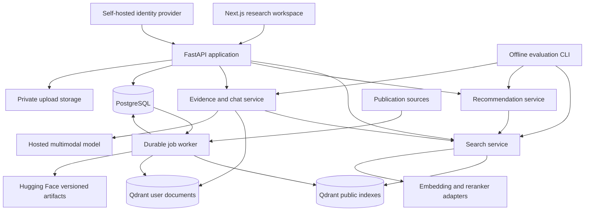

# ML Research Copilot — Technical Specification

Date: 2026-09-05. Status: proposed design for review; implementation has not started.

## 1. Intent and scope

Confirmed intentions: land a machine learning engineer role specializing in retrieval and recommendation; learn how the system works; attract researchers as real users. Support topic exploration, related-work discovery, and keeping up with research. The developer is the first test user. Confirmed budget constraints: the infrastructure budget is zero and permanent — PostgreSQL, Qdrant and file storage are self-hosted via Docker on the developer's own Windows machine — with the hosted LLM/multimodal generation API as the single named exception, funded personally by the developer. The project is portfolio-scoped, not production-scoped, for now. No time budget, GPU availability, research specialty, or launch date has been supplied.

This specification translates the [original proposal](C:/Users/hongp/Documents/Phuc/Projects/ml_rag_bot_recommender/ml_research_copilot_project_proposal.md) into a staged product. Unconfirmed choices below are design defaults, not requirements attributed to the user. The accompanying plans are drafts requested by the user; writing them does not authorize implementation or cloud spending.

The central product loop is: describe a research interest or choose seed papers → retrieve relevant work → inspect evidence → save or dismiss papers → obtain a better recommendation feed. Chat explains and synthesizes results. A researcher must also be able to use search and recommendations without invoking an LLM.

### Alternatives considered

| Approach | Benefit | Cost | Decision |
|---|---|---|---|
| Retrieval and recommendation core with a thin research UI | Produces measurable ML work and an early personal feedback loop | Rich chat arrives after search | Recommended |
| Chat and PDF assistant first | Quick conversational demonstration | Ranking and recommendation experiments arrive late | Preserve these features in milestone 4 |
| Full original architecture immediately | Broad feature coverage | Many services and integration risks before evidence of utility | Stage the architecture across milestones |

### Releases

| Release | User outcome | Required capability |
|---|---|---|
| M1 Corpus foundation | Inspect a reproducible paper dataset | Normalize, deduplicate, parse, track provenance, export snapshots |
| M2 Search laboratory | Find papers and measure ranking quality | BM25, dense, hybrid, reranking, benchmark harness, search API |
| M3 Personal research alpha | Explore, save, and receive recommendations | Auth, search UI, library, topics, seed papers, feedback, personalized content ranking |
| M4 Evidence assistant | Ask grounded research questions and read uploads | Evidence retrieval, citations, streaming chat, PDF and image QA |
| M5 Public beta (partially deferred) | Run and evidence a reliable product on local infrastructure | CI, observability and LLM cost tracking, local isolation tests; staged deployment, recovery drills and public quotas deferred |
| M6 Research expansion | Compare papers and explore stronger ML methods | More venues, graph features, bounded agent, learned ranking experiments |

The portfolio MVP is M1–M4 plus the free-tier-compatible subset of M5: deterministic CI (P5.1), tracing and LLM cost tracking (P5.2), the account-deletion lifecycle and a local backup/restore from P5.3 (both run on the local stack at no cost), the local isolation and failure tests (P5.4), and the case study (P5.5). The remainder of M5 — staged deployment onto rented infrastructure, RPO/RTO recovery drills, managed backup targets, and rate limiting whose purpose is protecting a paid public deployment from strangers' traffic — is deferred and not required for the portfolio deliverable; it is revisited only if a future recorded decision funds a public deployment. Superseded: earlier revisions defined the MVP as M1–M5 in full. M3 moves basic personalization earlier because recommendation is a stated career focus. M6 contains V2/V3 extensions. No feature is implicitly required before its release. Automatic emails, billing, collaboration, and mobile applications are outside this design.

## 2. Global constraints

These lines are copied into every implementation plan.

- Python 3.12; Node.js 22; TypeScript strict mode; UTF-8 files; UTC timestamps.
- Lock Python and JavaScript dependencies; pin container images and model revisions before benchmark or deployment runs.
- Hugging Face is an offline corpus/artifact destination and is never queried during user requests.
- Public corpus data and private user documents use separate Qdrant collections and storage namespaces.
- Derive user identity from a verified token; never trust a client-supplied user_id.
- All benchmark runs record corpus, split, model, configuration, code, hardware, and seed versions.
- No paid cloud resources, public publishing, or application implementation occur while preparing these documents.
- Postgres and Qdrant are self-hosted via Docker on the developer's own machine by default; no managed database, vector, or storage subscription is used unless a future, explicitly-recorded decision changes this.
- All persistent local data lives under one configurable root directory, default `C:\ml-copilot-data\` on the developer's machine, so the entire dataset can be deleted by removing that directory.
- The hosted LLM/multimodal generation API is the one paid resource in the project, funded personally by the developer; its cost tracking and daily spend cap from P5.2 remain required because real personal money is involved.

Version numbers above are project compatibility choices, not claims about the latest releases. Choose exact maintained package versions by resolver and compatibility tests in P1.1; record them in lockfiles. Avoid speculative package pins in a design document. Default local execution uses Docker Desktop Linux containers; PowerShell commands must work from the repository root. No Bash-only scripts in the critical development path.

## 3. Architecture and boundaries



Start with a modular Python application and one worker process sharing typed domain contracts. Do not introduce network boundaries between retrieval, recommendations, and RAG initially. Model adapters can run locally or call a separately deployed model process with the same contract. GPU-heavy work never runs directly in the ASGI event loop.

PostgreSQL owns canonical metadata, application state, durable jobs, and active corpus release. Qdrant is a rebuildable serving index. Both run self-hosted in Docker containers on the developer's own machine by default; no managed database or vector subscription is part of this design. Private file storage uses a local directory adapter under `DATA_DIR` regardless of deployment target; managed object storage is not assumed and would require an explicitly-recorded decision. Hugging Face stores only publishable corpus artifacts and versioned non-private experiments. Redis/Celery remain a later replacement if measured queue load warrants them; the initial durable queue uses PostgreSQL leases. PostgreSQL documents `SKIP LOCKED` as useful for queue-like access; it is not used for general consistent reads. [PostgreSQL SELECT documentation](https://www.postgresql.org/docs/current/sql-select.html).

### Local data root

All persistent local state lives under a single configurable root named by the `DATA_DIR` environment variable, whose documented default on the developer's Windows machine is `C:\ml-copilot-data\`. Deleting that one directory removes the entire local dataset. `DATA_DIR` is validated at startup like every other setting and is never hardcoded; other platforms and the CI runner supply their own value.

| Path | Contents |
|---|---|
| `${DATA_DIR}/postgres/` | PostgreSQL container data directory |
| `${DATA_DIR}/qdrant/` | Qdrant storage path for public and private collections |
| `${DATA_DIR}/uploads/` | private upload blobs written by the local directory adapter |
| `${DATA_DIR}/exports/` | local corpus-export staging and snapshot artifacts |
| `${DATA_DIR}/backups/` | database and upload-manifest backups, kept inside the deletable root |
| `${DATA_DIR}/models/` | pinned embedding/reranker weight cache (`HF_HOME`) for the `models` profile |
| `${DATA_DIR}/test/` | the isolated `test` profile's own `postgres/`, `qdrant/` and `uploads/` |

`DATA_DIR` sits outside the repository tree, so no bulk data enters version control. `.env.example` documents `DATA_DIR` with this default alongside the existing `test_`-prefixed service variables. `compose.yaml` bind-mounts the Postgres and Qdrant services to the `postgres/` and `qdrant/` subdirectories instead of named Docker volumes, so container state is covered by the same delete-one-directory guarantee; the isolated `test` profile uses a separate subdirectory so a destructive fixture cleanup can never reach developer data.

### Repository layout and ownership

```text
backend/pyproject.toml                  Python package and test/lint configuration
backend/uv.lock                         reproducible Python environment
backend/src/copilot/
  app.py, config.py, contracts.py       composition, configuration, public types
  db/models.py, db/session.py           persistence only
  corpus/sources/                      provider-specific metadata adapters
  corpus/normalize.py, dedupe.py        identity resolution
  corpus/parse.py, chunk.py             document structure and token chunks
  corpus/releases.py, export.py         versioned corpus and artifact publication
  jobs/queue.py, worker.py              leases, retries, handler dispatch
  search/lexical.py, dense.py           BM25 and dense candidate retrieval
  search/fusion.py, rerank.py           pure ranking and reranker adapter
  search/index.py, service.py, api.py   index lifecycle, orchestration, endpoints
  models/embeddings.py, generation.py   pinned external model adapters
  identity/auth.py                     token verification and principal
  library/service.py, api.py            saved papers and explicit interests
  recommendations/events.py            impression/feedback ingestion
  recommendations/profile.py           interest aggregation
  recommendations/rank.py, service.py  candidate scoring and feed construction
  recommendations/api.py               feed endpoints
  evidence/retrieve.py, citations.py    evidence selection and validation
  chat/router.py, service.py, api.py    deterministic routing and stream lifecycle
  uploads/storage.py, service.py, api.py upload authorization and jobs
  agents/graph.py                       M6 bounded graph
  evaluation/                          datasets, metrics, runners, reports
  cli.py                               offline administration and evaluation CLI
backend/migrations/versions/           Alembic migrations
backend/tests/{unit,integration}/      pure and service-level tests
frontend/src/app/                      Next.js pages
frontend/src/features/                 search, library, feed, chat, uploads
frontend/src/lib/{api,auth}.ts          typed transport and auth
frontend/tests/                        Playwright journeys and component checks
configs/                              corpus, model, ranking, evaluation, limits
data/fixtures/                        small synthetic or redistributable fixtures
infra/                                Dockerfiles and operational scripts
reports/                              small versioned evaluation summaries
docs/                                 specifications, plans, runbooks, experiment notes
```

No bulk data, secrets, private events, model weights, or PDFs are committed. Package name is `copilot`; command examples use `uv run --project backend ...`. Frontend commands use `npm --prefix frontend ...`. Every plan's paths are relative to this root; paths above describe future files, not an existing implementation.

## 4. Corpus policy and ingestion

### Coverage

Begin with a 100-paper pilot drawn from accepted ICLR 2024 main-conference papers; record exactly how the sample was selected. Expand to 1,000 eligible papers, then accepted ICLR, ICML, and NeurIPS main-conference papers with publication years 2022–2026 that actually exist as of each ingestion run. All three acceptance presentation types are eligible. Workshops, withdrawn/rejected submissions, and unpublished submission pools are excluded. Upcoming or incomplete venue-years remain explicitly incomplete. Publication year and first preprint date are separate fields.

The 60k–100k figure is a later capacity scenario across expanded venues, not an initial corpus count or a guarantee. For every venue-year show authoritative expected count when known, ingested count, abstract coverage, full-text coverage, failures, source URL, and as-of timestamp. Unknown denominator means coverage percentage is null.

### Sources and normalization

Use a versioned source manifest per venue-year. OpenReview accepted-paper selection depends on the venue's configuration; never equate all submission notes with accepted papers. Record the exact API version, venue ID, acceptance query, and source revision. [OpenReview note retrieval](https://docs.openreview.net/how-to-guides/data-retrieval-and-modification/how-to-get-all-notes-for-submissions-reviews-rebuttals-etc).

Official proceedings decide publication membership; OpenReview supplies matching metadata and PDFs; arXiv supplements accessible versions; Semantic Scholar enriches references/citations only where accessible. Enrichment failure must not block core ingestion. Provider throttling is configurable; honor Retry-After, use exponential backoff with jitter, persist pagination cursors, and retry at most five times before recording a terminal failure. No assumed API quota or guaranteed provider access.

Canonical papers use generated UUIDs that survive metadata corrections. Store external IDs in an alias table. Normalize DOI case/prefix, strip arXiv version suffix into a separate version field, normalize Unicode title whitespace, and retain original titles. Strong-ID collisions with contradictory metadata become conflicts for inspection. Normalized-title equality alone is not sufficient for automatic merging: require compatible authors and year; fuzzy matches are review candidates. Preserve merged IDs in a redirect table. Preprints and proceedings versions share a work ID while keeping document versions distinct.

PDF download validates scheme, approved source host, redirects and resolved IPs, maximum bytes, content type and magic bytes. Reject private/link-local network targets. Timeouts and source failures produce explicit parse states; a missing PDF leaves a searchable abstract. Parsing uses a pinned Docling adapter initially; keep source page coordinates and compare 20 papers manually before expanding. Docling supports structured document conversion, which motivates this candidate; parser accuracy remains a project experiment. [Docling documentation](https://docling-project.github.io/docling/).

### Chunking

Persist heading hierarchy, page spans, text offsets, parser version and PDF checksum. References are stored separately from normal evidence chunks. Default chunks target 450 embedding-tokenizer tokens, hard cap 600, with 60-token overlap within a section only. Tables remain coherent where possible; oversized tables get labeled fragments with repeated headers. Preserve original text separately from embedding text. Heading text may be prepended for embedding but never mistaken for a quoted passage. Chunk IDs are UUIDv5 over work ID, document checksum, parser/chunker versions, section ordinal and chunk ordinal.

Unknown page positions remain null; never invent page numbers. Fallback plain text is marked low quality; no full-text evidence claims are made when only the abstract is indexed. Chunking controls are experiment settings, not assumptions of superiority.

### Jobs and publication

Jobs: `queued → running → succeeded | retry_wait | failed | cancelled`. Fields include attempt, next_attempt_at, lease_until, heartbeat_at, idempotency_key, error_code, progress_done and progress_total. Unique idempotency key includes operation, source item revision and processing version. Workers lease a job transactionally, perform external work outside the transaction, heartbeat, and commit output/checkpoint together. A lost lease cannot mark success. Retried work performs idempotent upserts. Recovery tests must cover worker death after each external write.

Build immutable index collections per corpus release. A PostgreSQL active-release pointer identifies the matching paper and chunk collection names plus model revision. A request reads that pointer once and uses it throughout. Validate counts, vector dimensions, checksums, and search canaries before changing the pointer. Keep the prior release for rollback. Never mix new paper vectors with old chunk vectors during publication.

Export metadata and processed text as 128–512 MiB target Parquet shards plus a manifest with checksums, source provenance, redistribution eligibility, schema and processing versions. Hugging Face supports Parquet dataset uploads. [Hugging Face dataset uploads](https://huggingface.co/docs/hub/datasets-adding). Public availability of a PDF does not by itself establish redistribution rights: store per-record eligibility and keep unknown/restricted full text out of public exports. This is a data publication design requirement, not a legal determination. Private uploads and user history never enter corpus exports.

## 5. Relational and vector schemas

UUID primary keys unless otherwise stated. All timestamps are timezone-aware. Soft-deleted user objects are excluded at the repository boundary. Foreign keys and unique constraints are migrations, not only application checks.

| Table | Required fields and constraints |
|---|---|
| papers | id, title, abstract nullable, publication_year, venue_id, first_published_at nullable, first_seen_at, pdf_url nullable, acceptance_type, metadata_status, merged_into nullable |
| paper_identifiers | paper_id FK, namespace, value, version nullable; unique(namespace,value) for canonical ID |
| paper_versions | id, paper_id FK, source_url, source_revision, content_sha256, license_label nullable, redistribution enum, parser_version, parse_status |
| authors / paper_authors | id/name; paper_id+position PK, author_id FK; preserve author order |
| venues | id, name, track; unique(name,track) |
| paper_edges | source_paper_id, target_paper_id, relation, observed_at, snapshot_id; composite unique key |
| citation_snapshots | paper_id, observed_at, count; nonnegative count; never overwrite historical count |
| corpus_releases | id text PK, manifest_sha256, paper_collection, chunk_collection, model_revision, status, counts JSONB |
| active_release | singleton key, corpus_release_id FK; transactional switch |
| chunks | id, paper_version_id, section_path, page_start/end nullable, ordinal, text, token_count, chunker_version |
| source_checkpoints / jobs | source+partition cursor; durable job fields from section 4 |
| users | id equals authenticated subject, created_at, deletion_requested_at nullable |
| interests | id, user_id, label, created_at; unique(user_id,label) |
| preference_events | id, user_id, kind(topic/seed), value, action(add/remove), received_at; append-only history for temporal profile reconstruction |
| seed_papers / saved_papers | user_id+paper_id PK, created_at |
| impressions | id, user_id, request_id, surface, paper_id, position, model_version, corpus_release_id, served_at, visible_at nullable |
| interactions | id client UUID, user_id, paper_id, impression_id nullable, event_type, occurred_at, received_at; unique(user_id,id) |
| recommendation_runs/items | run ID, user_id, profile_version, corpus_release_id, model_version, created_at, expires_at; item rank, paper_id, component_scores JSONB, reason JSONB |
| chats / messages | owner on chat; message ID, chat_id, role, mode, text, status, request_id, usage JSONB; unique(chat_id,request_id,role) |
| message_citations | message_id, evidence_id, paper_version_id or upload_id, chunk_id, page span, quote, validation_status |
| uploaded_documents | id, user_id, blob_key, content_sha256, filename, mime_type, bytes, status, expires_at, deleted_at nullable |
| evaluation_runs | id, task_type, manifest JSONB, metrics JSONB, report_path, started_at, completed_at, status |

Index papers by venue/year, identifiers by unique namespace/value, chunks by document version/ordinal, events by user/time and impression ID, jobs by state/next_attempt_at, uploads by user/status, and feed items by run/rank. Add a uniqueness rule for active upload content per user to make repeated uploads idempotent. No cross-user content-deduplication disclosure.

Public Qdrant collections: `paper_abstracts_<release>`, `paper_chunks_<release>`. Upload collection: `user_documents_<embedding_revision>`. Dense vectors use cosine similarity. The initial dense candidate is `BAAI/bge-m3`, 1024 dimensions; this is its documented dimensionality, not a tuned project result. [BGE-M3 model card](https://huggingface.co/BAAI/bge-m3).

Paper/chunk collections have named dense and BM25 sparse vectors; optional BGE learned sparse is a separately named experiment. A learned sparse encoder is not called a BM25 baseline. Point payloads include canonical IDs, year, venue, version, section, availability and deletion state. Index fields used in filtering. Qdrant provides named-vector and hybrid query support. [Qdrant hybrid queries](https://qdrant.tech/documentation/search/hybrid-queries/).

Upload collections initially use dense retrieval only to avoid sharing sparse IDF statistics across users. Every query and mutation carries server-derived user_id and authorized document IDs. Tenant payload indexes improve retrieval organization but do not replace application authorization. [Qdrant multitenancy](https://qdrant.tech/documentation/manage-data/multitenancy/).

## 6. Core contracts

Define these in `backend/src/copilot/contracts.py` as Pydantic models unless explicitly a Protocol. JSON UUIDs are strings; examples may use short fixture IDs in pure ranking tests. Production schemas validate UUIDs.

```text
Principal(user_id: UUID)
PaperFilters(year_from: int|None, year_to: int|None, venues: list[str], fulltext_only: bool=False)
SearchRequest(query: str,
              mode: Literal['bm25','dense','hybrid','hybrid_rerank','hybrid_rerank_llm'],
              filters: PaperFilters, limit: int=20, cursor: str|None=None)
RankedPaper(paper_id: UUID, score: float, scores: dict[str,float], rank: int)
ListwiseResult(order: list[int], ranked_by_model: int, cost_usd: float,
               served_model: str, cached: bool)
PaperSummary(title: str, authors: list[str], venue: str, year: int, abstract: str|None,
             pdf_url: str|None, fulltext_indexed: bool)
SearchResponse(request_id: UUID, corpus_release_id: str, items: list[RankedPaper],
               papers: dict[str,PaperSummary], next_cursor: str|None,
               degraded: bool, warnings: list[str])
FeedbackEvent(id: UUID, paper_id: UUID, impression_id: UUID|None,
              event_type: Literal['open','save','unsave','like','dislike','read','ask'], occurred_at: datetime)
RecommendationRequest(limit: int=20, refresh: bool=False)
FeedResponse(request_id: UUID, run_id: UUID, items: list[RankedPaper], reasons: dict[str,dict],
             papers: dict[str,PaperSummary], impressions: dict[str,UUID],
             stale: bool, profile_version: str, corpus_release_id: str)
Evidence(id: str, source_kind: Literal['paper','upload'], source_id: UUID,
         version_id: str, chunk_id: UUID, text: str, section: str,
         page_start: int|None, page_end: int|None)
Claim(text: str, evidence_ids: list[str])
GroundedAnswer(claims: list[Claim], insufficient_evidence: bool)
ChatRequest(request_id: UUID, chat_id: UUID|None, message: str,
            mode: Literal['auto','general','research','document'], document_ids: list[UUID])
JobStatus(id: UUID, status: str, progress_done: int, progress_total: int|None, error_code: str|None)
```

Service signatures are defined by their implementation tasks. Model Protocols: `EmbeddingModel.encode(texts: list[str]) -> list[list[float]]`; `Reranker.score(query: str, texts: list[str]) -> list[float]`; `Generator.answer(question: str, evidence: list[Evidence]) -> GroundedAnswer`. All batches preserve input order and reject nonfinite values or dimension mismatch. Async adapters may wrap these operations off the event loop; never change domain return shapes to provider-specific objects.

## 7. Retrieval and ranking

Canonical paper text is `title + '\n' + abstract`; preserve technical acronyms. Initial lexical configuration: Unicode normalization, lowercase, tokenization retaining alphanumeric terms; BM25 k1=1.2 and b=0.75. Pin vocabulary/document-length statistics to a release. Implement an exact fixture BM25 oracle and compare server results with it before calling production sparse retrieval BM25. If using a provider BM25 implementation with different tokenization/scoring, document it as that variant and benchmark independently.

For the initial exact sparse implementation, assign term IDs from the release's sorted vocabulary. Document weight is `tf*(k1+1)/(tf+k1*(1-b+b*dl/avgdl))`; unique query-term weight is `log(1+(N-df+0.5)/(df+0.5))`. Their sparse dot product reproduces the oracle. Query terms absent from the vocabulary are omitted. Use no server IDF modifier for these already weighted vectors. Paper and chunk collections have separate corpus statistics; record both. Changing the corpus statistics creates a new release and re-encodes document weights.

Embed normalized title/abstract using a pinned BGE-M3 revision. Batch offline embeddings; run CPU float32 as correctness baseline and GPU reduced precision only after comparison. Use 1024 input tokens for paper embeddings initially and record truncation rates. Store dense vectors L2-normalized; query vectors must use the identical model and preprocessing revision.

Online flow: validate input → capture release → apply filters to both candidate searches → retrieve 100 BM25 and 100 dense candidates → deduplicate → RRF → rerank at most 50 → return 20. Both candidate searches read the **chunk collection**, each paper scored by its best evidence chunk (references excluded; `candidates.source: chunks` in `configs/search.yaml`), decided 2026-10-06 in P2.6: on the in-domain validation split a pre-registered rule promoted it over title-and-abstract candidates (Recall@50 +0.135 [+0.058, +0.231], nDCG@10 +0.060 [+0.025, +0.097], p95 597 ms; `reports/m2-retrieval-gaps.md`). A release with no chunk collection — a packaged benchmark corpus such as LitSearch's — is searched at paper level, and the cache identity names the source. RRF is `sum(1/(60+rank))`, one-based rank per list; duplicate IDs within a list count once; ties sort by canonical paper ID. Implement the formula in application code for explicit reproducibility; do not assume a server's default fusion constant equals 60.

Initial cross-encoder candidate: `BAAI/bge-reranker-v2-m3`. It scores query/text pairs rather than producing embeddings. [Reranker model card](https://huggingface.co/BAAI/bge-reranker-v2-m3). Default pair budget is 1024 tokens; test 512 versus 1024 for latency/quality. Preserve query tokens and truncate document text. Scores are ranking signals, not calibrated relevance probabilities.

Paper search supports year, venue, availability, and explicit mode. No citation-count boost in the main relevance baseline. Publish both candidate recall and final ranking scores; a reranker cannot recover missing candidates. Top 200 ordered results may be cached for 10 minutes under query/filter/release/model key; cursor includes signed request ID and offset. Cursor expiry returns `cursor_expired`, prompting a fresh search. Display limited result count without inventing a total corpus match count.

For `hybrid_rerank`, cache only the reranked candidate set (at most 50); do not compare reranker logits with RRF scores for appended candidates. Other modes may cache up to 200. The paging response exposes the cached set's boundary honestly.

Search degrades explicitly: reranker timeout returns RRF order with warning; one candidate branch unavailable returns the surviving branch with warning; both fail returns retryable 503. Cache includes release/model versions and excludes private data from public keys.

`hybrid_rerank_llm` is opt-in deep search (decided 2026-10-02; plan `2026-10-01-llm-reranking.md`). It runs `hybrid_rerank` unchanged, inside the 3-second total, then sends the reranked head to a hosted LLM. Each candidate is cut to its first 300 words, under a bracketed identifier, and the LLM answers with an order (`[3] > [1] > [2]`), as LitSearch's listwise reranker does. The answer is parsed into a strict permutation of exactly the head: repeated or out-of-range identifiers are dropped, and candidates the LLM omits follow in their incoming order. The LLM can therefore reorder the head but never add or drop a candidate. Scores become ordinal (head size minus position), and `scores.llm_rank` records the LLM's one-based position. The stage has its own budget (20 s, inside a 25-second deep-search total). Any failure keeps the cross-encoder's order, with a warning by cause: `llm_rerank_timeout`, `llm_spend_cap`, `llm_rerank_unparseable` and `llm_rerank_failed`. Without a configured LLM, the mode serves `llm_rerank_unavailable` and never fails. Like `hybrid_rerank`, it caches only its reranked head. Its cache identity adds the listwise reranker's identity: model, prompt digest and word budget. Warm-up never calls the LLM. Search without an LLM is unaffected (§1).

## 8. Recommendations

### Onboarding and candidates

Ask for 1–3 topic interests or 3–10 seed papers; both are optional. With no signals, use a transparent recent/popular feed labeled unpersonalized. Maintain separate controls for topic exploration, related work from a seed paper, and the continuing personalized feed. Search intent and feed preferences are not conflated.

Build candidates from: top 200 nearest to profile, up to 100 combined seed neighbors, 100 recent papers in explicitly selected topic candidates, and 50 popularity candidates. Deduplicate, apply corpus eligibility, exclude saved/read/explicitly disliked papers from discovery feed, and exclude the seed itself from related papers. At most 450 candidates enter ranking. Topic candidates are the top 1,000 semantic matches to each chosen interest in the active release; recent branch orders their union by first_seen_at. No invented topic taxonomy is required.

### Profile and scoring

Initial positive event weights: save=3, like=4, read=2, ask=1, open=0.25. Deduplicate retries; cap repeated open/ask contribution to one per paper/day. Unsave removes the saved-state contribution; it is not a dislike. Dislike excludes the paper and adds a separate negative preference signal. Topic and seed priors have weights 2 and 3 respectively. Positive event decay uses `exp(-ln(2)*age_days/30)`. Profile is the normalized weighted mean of positive vectors plus priors. If the norm is below 1e-8, use the explicit-interest vector or unpersonalized fallback. Historical positive contributions for an actively disliked paper are suppressed.

Save/like/read are stateful contributions per paper, not additive votes on every repeated event. Use the latest state transition timestamp for decay. Append topic/seed changes to preference_events in the same transaction that updates current preferences, so historical evaluations can reconstruct them. Library saves and save-feedback events share one mutation path.

Score components are bounded to [0,1]: positive cosine maps via `(cos+1)/2`; seed similarity is maximum mapped cosine over seed papers; freshness is `exp(-ln(2)*age_days/180)` using publication date when known and first_seen_at otherwise; popularity is empirical percentile of log1p citation count within publication year from the latest available snapshot. Missing citations receive 0.5 and a missing flag. Negative affinity is max mapped cosine to disliked papers; omit the penalty if none.

Initial heuristic score: `0.55*profile_similarity + 0.20*seed_similarity + 0.15*freshness + 0.10*popularity - 0.20*negative_affinity`. When seed signal is absent redistribute its 0.20 proportionally across the available positive components; do not do so for missing citation count because that already has a neutral default. All weights are versioned hypotheses to tune on development labels.

Diversify with MMR lambda=0.8 over bounded positive relevance versus maximum mapped cosine similarity to already selected papers. Explicit exclusions always win. Show faithful reasons from actual components: similar to named saved paper, matches chosen interest, or recently added. Do not fabricate natural-language justifications from an LLM.

### Feedback and refresh

Create server-side served impressions with request/run ID, rank and version. Mark visible impressions after at least 50% of the card is visible for one second. Opens/saves/likes reference an impression when one exists; library actions can omit it and do not count as feed conversions. Event ingestion validates ownership and idempotency. Store client and server time; use received_at for availability and reject client timestamps more than five minutes in the future.

Refresh the profile on explicit feedback or seed/topic changes; debounce feed recomputation by 10 seconds. Feed expires after 24 hours or a release/profile change. Serve a previous feed marked stale while recomputing; generate a fallback on first visit. Filter newly excluded papers again at read time. Do not make a recommender availability failure break the library.

### Evaluation with one user

Start with 20 written research-interest profiles and 20 candidate judgments each, scored 0–3 for relevance plus a separate novelty judgment. These are developer-authored evaluation cases, not independent users. Split profile families 12/4/4 into development, validation and locked test to reduce near-duplicate leakage. Conduct blinded, shuffled judgments across popularity, content, and personalized candidates. Reassess 10% after one week to quantify self-consistency.

Collect a personal longitudinal log for at least four weeks. Evaluate using rolling time cutoffs: features, edges, citation snapshots, paper availability and profile events must all be available before the cutoff. Repeated feedback for the same work cannot cross train/test as independent targets. Unexposed papers are unjudged, not negative examples. Save/like rate per visible impression and useful new papers per session are descriptive personal signals, not estimates of population preference.

Evaluate nDCG@10, judged Precision@10, judged coverage, intra-list diversity and catalog coverage; report recommendation recall only for a defined judged universe. Keep preference-test profiles separate from retrieval-query test labels. Collaborative filtering is deferred until real multi-user interactions and a credible temporal benchmark exist.

## 9. Evidence, chat, uploads and agent behavior

Research mode retrieves 10 papers then searches chunks inside those papers, reranks up to 40 chunk candidates, and selects up to 12 pieces of evidence with a maximum of three per paper. Evidence budget is 6,000 generation-tokenizer tokens, reserving room for instructions, conversation and answer. Abstract evidence is labeled abstract-only. If paper selection misses evidence, compare against global chunk retrieval and a union fallback; hierarchical retrieval must win by measurement, not assumption.

General mode answers without corpus evidence and is labeled accordingly. Auto mode initially follows explicit attachments/mode, then a small tested routing policy. Document mode searches only authorized selected uploads. Research mode never silently searches private documents. M6 may replace heuristic routing with a measured classifier or bounded LangGraph graph.

Generate structured claims with evidence IDs. Validate that IDs exist in the selected evidence and belong to the authorized release/documents. Validate any quoted spans against stored source text. Structural validation proves provenance, not semantic entailment. Claim support is judged in the evaluation pipeline; unsupported claims are removed or qualified. One repair attempt is allowed; then return a clear insufficient-evidence response with retrieved papers.

Use POST streaming via fetch with SSE framing: `status`, `evidence`, `delta`, `final`, `error`. In research/document modes send status/evidence immediately, buffer and structurally validate the answer, then stream validated answer text. General mode can stream model deltas immediately. A response becomes complete only after a final event. Disconnect cancels pending model work where supported; incomplete messages stay interrupted and never count as completed evaluation examples. An idempotent request_id prevents duplicate persisted answers; replay of completed requests returns the stored final answer.

Uploads: PDF at most 25 MiB and 100 pages; PNG/JPEG/WebP at most 10 MiB and 20 megapixels after decode. Validate content, not filename alone. Sanitize display name and use random private blob keys. PDF parsing runs in an isolated worker with 120-second budget and bounded memory; encrypted/unsupported PDFs return typed errors. Upload returns 202 and job/document IDs. Query is enabled only after `ready`. Parsing failure is visible with retry guidance.

Images go through a hosted multimodal adapter with explicit visual interpretation labeling. For PDFs, retrieve text and render relevant pages for figure questions; evidence records page-image references and document ID. Image description is not treated as verified numeric extraction. Retain private uploads for 30 days by default, with user deletion at any time; account deletion removes blobs, vectors, events, recommendations and owned chat content. Deletion immediately hides documents, queues physical deletion, and finishes within 24 hours; test failures and retry until complete.

Paper comparison in M6 accepts 2–5 user-selected papers and returns methods, datasets, metrics, reported results, compute and limitations with evidence per cell. Missing information is explicitly unavailable. Do not label unlike metrics or datasets as directly comparable. Agent limits: six tool calls, two search rounds, 30-second orchestration deadline, no open-ended recursion. External web research is opt-in in M6 and its evidence remains distinguished from the indexed corpus.

## 10. HTTP API and user interface

All successful JSON responses include request_id; errors use `{error:{code,message,retryable},request_id}`. Validate query length 1–2,000 characters and limit 1–50. Validation failures 422; authentication 401; unauthorized object IDs return 404; rate limits 429; dependencies unavailable 503. CORS uses exact configured origins.

| Endpoint | Input / output | Access |
|---|---|---|
| GET /health/live; GET /health/ready | process state; DB/index release availability | public, no secrets |
| GET /v1/corpus/coverage | venue-year counts and dates | public |
| POST /v1/auth/token | email/password → short-lived access token from the self-hosted identity provider (P3.1) | public with rate limit |
| POST /v1/search | SearchRequest → SearchResponse plus paper metadata; `mode: hybrid_rerank_llm` is opt-in deep search (§7) | public with rate limit |
| GET /v1/papers/{id} | canonical metadata, availability, source links | public |
| GET /v1/papers/{id}/related | seed candidates ranked, seed excluded | public |
| GET/PUT /v1/me/interests | topics and seed IDs | owner |
| GET /v1/library; PUT/DELETE /v1/library/{paper_id} | saved papers and timestamps | owner |
| POST /v1/impressions/{id}/visible | exposure update, idempotent | owner |
| POST /v1/events | FeedbackEvent → accepted/duplicate | owner |
| POST /v1/recommendations | RecommendationRequest → FeedResponse | owner |
| POST /v1/chats/stream | ChatRequest → SSE | owner |
| GET /v1/chats; GET /v1/chats/{id} | history and citation records | owner |
| POST /v1/uploads | multipart → document_id/job_id | owner |
| GET/DELETE /v1/uploads/{id} | status or deletion job | owner |
| GET /v1/jobs/{id} | JobStatus; expose only owned jobs | owner |
| DELETE /v1/me | account deletion job | owner |
| POST /v1/compare | 2–5 paper IDs and comparison question | owner, M6 |

Backend validates signature, issuer, audience, expiry and subject against the locally configured signing keys of the self-hosted identity provider; the key cache supports rotation and refreshes once on an unknown key ID. [JWT claim validation](https://datatracker.ietf.org/doc/html/rfc7519#section-4.1).

Superseded decision: earlier revisions delegated authentication to Supabase Auth. Hosted Supabase Auth is not offered independently of a Supabase-managed PostgreSQL instance — its user records live in that managed database — so an auth-only dependency cannot satisfy the self-hosting constraint in §2, and account identity would sit outside `DATA_DIR` and outside the delete-one-directory guarantee. Free-tier availability terms (inactivity pausing, monthly-active-user allowances) are vendor policy that this revision cannot verify, which points the same way. The project therefore runs its own identity provider: email/password credentials hashed with Argon2id ([RFC 9106](https://datatracker.ietf.org/doc/html/rfc9106)) in the local PostgreSQL database, application-issued JWTs signed by a key held in server-side configuration, and the claim validation and rotation discipline described above. The credential store and its migration are owned by P3.1. Because the primary user is the developer, self-service signup can stay closed by default and accounts can be created by an administrative CLI command until a pilot needs otherwise. Use a non-owner DB role with row-level policies for private tables and transaction-scoped user identity; test the backend's real DB role. A service-role credential must not accidentally bypass policies in normal user requests. Qdrant remains server-only. Mock auth is allowed solely in test configuration and must fail startup in production.

Frontend pages: `/search`, `/papers/[id]`, `/feed`, `/library`, `/chat/[id]`, `/settings`. Shared paper cards show title, authors, venue/year, source, availability, save/dismiss controls and recommendation reason where relevant. Expand evidence alongside the answer; citations open original source/page when known. Show corpus coverage and as-of date from the API. Support loading, empty, expired session, degraded search, failed upload, stale feed and insufficient-evidence states. Keyboard navigation, labeled inputs, visible focus and accessible status updates are acceptance criteria.

## 11. Evaluation and progress gates

Create evaluation capability during M1/M2, before tuning. No benchmark result is supplied by this document.

Retrieval set: pilot 30 genuine tasks across topic discovery, related work and keeping up; expand to 150 query families split 90 development / 30 validation / 30 locked test. Rewrites stay in the same family/split. Judge a deduplicated pool of top 10 per baseline plus manually known relevant papers, with method identity hidden. Label 0 irrelevant, 1 peripheral, 2 useful, 3 directly relevant. Record evidence and judgment rationale. Test judgments stay out of prompt/ranking tuning. A new system's unjudged results trigger fresh blind assessment and a versioned comparison; do not silently score all unjudged items as irrelevant without reporting judged coverage.

Open RAG Bench, text slice (added 2026-10-07; plan `2026-10-06-orb-text-benchmark.md`): Vectara's 1,000 arXiv papers and the 1,914 text-only questions among its 3,045, each with one gold document and one gold section, loaded through this pipeline into a separate, never-activated release. Retrieval reads all 1,914 under the shipped configuration and never decides; `section_hit@1` is, over the queries whose gold section was located in our chunks (a run of at least three of its sentences, or 40% when fewer), the share whose rank-1 paper is the gold paper and whose best chunk lies in that section, always reported with that coverage. The frozen 400-case sample is G4's answer-and-citation benchmark beside the hand-written set below; the two are complementary, since ORB has no multi-paper or unanswerable questions. The dataset is CC-BY-NC-4.0 and its text never enters the repository, a report or an export.

RAG set: 60 cases, including 10 unanswerable and 10 requiring multiple papers, grouped by question family into 36 development / 12 validation / 12 test. Each records reference claims, supporting paper versions/chunks and unsupported claim traps. Human-calibrate a judge on 30 development/validation answers initially, grow to 50–100 before stronger quality claims. Measure agreement and inspect disagreements; don't use the same generated answer as its own reference. Use a separate configured judge model where possible and report correlated-bias limitations.

Run manifest includes run_id, git SHA, corpus release/checksum, dataset/split revision, parser/chunker, embedding and reranker revisions, generation/judge model IDs, prompts, seed=42, parameters, hardware, timing methodology and incurred cost. Metrics export JSON, per-query Parquet and a Markdown experiment report. Log query-level failures; do not silently omit them from latency or quality denominators.

| Gate | Required evidence | Pass rule |
|---|---|---|
| G1 Corpus | 100-paper replay, conflict report, 20-paper parse audit | zero duplicate strong IDs; repeat run changes no canonical IDs; every failed parse classified; ≥90% audited usable text or parser revised |
| G2 Retrieval | all four baselines on same frozen snapshot | report Recall@50, MRR@10, nDCG@10, judged coverage and p50/p95; hybrid/rerank promoted only if validation quality justifies latency |
| G3 Recommendations | 20 profiles + personal feedback log | no seen/disliked leakage, cold start works, versioned comparisons and diversity; no population-level claim |
| G4 Evidence | citation tests, 60-case dataset, judge calibration | zero fabricated IDs; ≥95% provenance validity; target ≥90% supported factual claims on human audit, otherwise narrow release behavior |
| G5 Beta | staging load, tenant isolation, deletion, restore, pilot journeys | no cross-user access in adversarial tests; restore verified; limits active; all three research workflows complete |
| G6 ML extension | temporal benchmark and ablations | model promoted only with measured benefit and a reproducible report; negative results are valid output |

Quality targets are initial engineering acceptance targets. Tighten/adjust in a recorded decision after the pilot; do not lower a gate silently to label a run successful. Recall is recall against the judged pool, not all unknown relevant papers. Report uncertainty using query/profile-level bootstrap with 1,000 resamples; correlated profiles from one author are a stated limitation.

CI deterministic smoke set: synthetic licensed fixtures and fixed outputs, no network/model downloads. Regression thresholds: fail when Recall@10 or nDCG@10 declines by more than 0.03 absolute on the fixed smoke set, or citation provenance checks fail. On larger model benchmarks show paired differences/confidence intervals and make a documented promotion decision; a noisy small test is not a significance claim.

## 12. Operations, latency, capacity and cost

Local Compose profiles: `core` (Postgres, Qdrant, API, worker, frontend), `models` (embedding/reranker), `test` (isolated services). All profiles are self-hosted on the developer's machine and read their storage paths from `DATA_DIR`. Configuration uses validated environment variables; production refuses missing auth, unrestricted CORS, default secrets or mock model mode, and every environment refuses an unset data root. Runtime DB, vector credentials and model keys stay server-side. Pin selected patched images by digest during implementation.

Default beta limits: anonymous search 10 requests/minute/IP; authenticated search 30/minute/user; 20 generated answers/user/day; two concurrent generations/user; 10 uploads/user/day; 20 feed refreshes/hour/user. Use durable atomic counters initially in PostgreSQL, with configurable trusted-proxy handling for IPs. Enforcement must work across multiple API processes. Offer an operator-configured daily provider spend cap; priced model calls are disabled when cost configuration is missing. "Provider" here means the hosted LLM/multimodal generation API specifically — together with any reranking-adjacent hosted model call, should one ever be configured — which is the single paid line item in this project and is funded personally by the developer. The cap and per-request cost logging therefore protect real personal money and remain required. No actual budget amount is assumed. The providers are OpenAI and DeepSeek, through OpenAI-compatible Chat Completions (decided 2026-10-02). The spend ledger has been live since the LLM reranking plan's L1. Every priced call first reserves its worst-case cost in `llm_calls` under the operator's `LLM_DAILY_SPEND_CAP_USD`, and a refusal means no request is sent. The call then settles at the cost its reported usage implies. When the usage is unknown, it keeps the whole estimate. A call that every attempt saw refused outright with a 4xx settles at zero. The ledger stores no prompt, query or response. Record fixed hosting and metered model costs separately; self-hosted infrastructure contributes no metered cost, so fixed hosting is zero by default. During the portfolio phase the quota numbers above are implemented and tested against the developer's own traffic; enforcing them against public multi-tenant traffic is deferred with P5.2.

Proposed performance budgets measured on declared hardware, 1,000-paper pilot then actual beta corpus, concurrency 5: search p95 ≤3 seconds warm, except opt-in deep search (`hybrid_rerank_llm`), whose p95 budget is 20 seconds; cached feed p95 ≤500 ms; research status/evidence first event ≤3 seconds where retrieval succeeds; completed text answer p95 ≤20 seconds excluding uploads; 20-page PDF processing p95 ≤120 seconds. Timeout fallback behavior still applies if budgets are missed. Report cold starts separately. These are targets, not advertised performance.

Capacity example: 100k papers ×30 chunks=3 million chunk vectors; 1024 float32 dimensions require 12.288 GB decimal for raw dense chunk vectors alone. Paper vectors add 0.410 GB. Graph index, sparse postings, payload text, replicas, build overlap, backups and model memory are extra. Corpus growth is bounded by free disk and RAM on the developer's own machine, not by a subscription tier. Measure bytes/point and build throughput at 1k and 10k papers before committing to a larger corpus, and record the machine's actual free disk and available memory alongside those measurements. Stage full-text indexing independently from abstract coverage if needed. Never infer that headroom measured at pilot scale extends to the eventual corpus.

Tracing: request ID across API, retrieval branches, reranker, context, generation and jobs. Record candidate IDs/counts, timings, versions, token/cost usage and typed failures. Raw private queries/uploads are excluded from default traces; opt-in diagnostic capture is redacted with seven-day retention. Structured operational metadata retains 30 days. Feed interactions remain until account deletion or a 180-day retention job. Exports for research reports contain aggregated or synthetic data.

CI on every PR: Ruff, type checks, pytest unit, Docker integration, frontend type/lint, fixture Playwright, deterministic regression and image build. Manual/nightly expensive suite: pinned real models, larger frozen evaluations, cost limit and artifact report. Deployment: publish exact tested image digest to staging, run migrations using expand/contract, smoke tests, then release. Backend/worker require a long-lived container host and persistent private storage adapter; model serving capacity is selected after measurement. The default deployment target is the developer's own machine: PostgreSQL, Qdrant, API and worker run as self-hosted Docker containers against `DATA_DIR`. Managed alternatives — Supabase for PostgreSQL or auth, Qdrant Cloud for vectors, any hosted object-storage bucket — are optional and deferred, and remain out of scope until an explicitly-recorded decision funds them. Vercel's free tier may host the frontend, which stores no data. Concrete hosts and prices are an implementation-time choice informed by measured capacity, not a prerequisite of this design.

Daily DB backups; periodic corpus/vector snapshot plus reproducible index rebuild. Backups are written under `${DATA_DIR}/backups/` so they stay inside the single deletable data root; a managed backup target is deferred. Beta recovery targets: RPO 24 hours and RTO 4 hours, verified in staging. Deferred for the portfolio phase together with P5.3: those targets describe a funded or always-on public deployment, and the staged drill verifying them is not required for the portfolio deliverable. The local equivalent — back up, restore into a clean local namespace, and check counts — stays in scope and remains good portfolio evidence. Keep previous corpus and application release; roll back pointers/images separately. Qdrant down makes readiness fail and search return typed 503; library remains available when DB is healthy. Model down preserves search, library and feed fallback. Deployment health cannot pass by checking only process liveness.

## 13. M6 extension boundaries

Extend venues in batches: ACL/EMNLP/NAACL via authoritative Anthology manifests; CVPR/ICCV/ECCV via official proceedings; AAAI/KDD via their authoritative publication lists. Each adapter repeats the same membership, normalization, rights, replay and coverage gates. A smaller curated older-paper context set can address pre-2022 foundational works, but is displayed as a separate coverage expansion and benchmark revision.

Graph recommendation uses available-at-time citation edges as an additional candidate source and scored feature. Compare popularity, embedding similarity, graph-only and hybrid before adoption. Optional Semantic Scholar recommendation baseline is labeled external-service comparison; unavailable access does not block in-house evaluation.

Learned ranking is an experiment after a data audit: target at least 200 distinct development query families and 2,000 human-audited query/paper labels, plus a separate locked test set. These are starting experiment criteria, not assurances of sufficient data. Train a tree-based learning-to-rank model over BM25/dense/reranker/recency features before considering reranker fine-tuning. Group splits by query family and paper version; mine negatives from training-only retrieval. Synthetic labels can augment training with provenance but never replace human test labels. Evaluate learning curves and abandon training if it fails the quality/latency gate. Collaborative filtering remains conditional on multiple real users.

Research landscape synthesis is a bounded multi-paper report: approaches, representative papers, reported limitations, and cautiously labeled possible future directions. Each factual claim links to evidence. No claim of exhaustive coverage or automatic discovery of validated research gaps.

## 14. Traceability and unresolved choices

| Proposal area | Implementation ownership |
|---|---|
| §§3–8 corpus, sources, storage, parsing | P1.1–P1.5; P6.1 expansion |
| §§9–11 search, reranking, hierarchy | P2.1–P2.5; P4.1 |
| §§12–15 routing, model, multimodal, agents | P4.2–P4.5; P6.2 |
| §16 recommendations | P3.2–P3.5; P6.3–P6.4 |
| §§17–19 evaluation and regression | P2.1/P2.5; P3.5; P4.5; P5.1 |
| §§20–22 UI, API, workers | P1.4; P2.4; P3.1/P3.4; P4.3–P4.4 |
| §§23–26 infra, deployment, CI, tracing | P1.1; P5.1–P5.5 |
| §§27–30 architecture, Open WebUI reference, MVP | this specification; P1–P5 |
| §§31–33 V2/V3 and experiments | P6.1–P6.5 |
| §§34–37 technical story, principles, ordering | roadmap, milestone evidence, P5.5/P6.5 |

Before resource provisioning, settle the available local hardware (free disk, RAM, and whether a usable GPU exists) and the personal monthly ceiling for the hosted generation API. Managed-provider access and region are not applicable while the default stack is self-hosted; they become open questions only if a future recorded decision funds a public deployment. Before a public beta — itself deferred — choose a concrete initial research community and recruiting route; none is assumed from the user's self-testing plan. Before the first corpus benchmark, the user supplies their first genuine queries/interests or records that initial cases are developer-authored provisional tasks. Before implementation, review the design defaults, milestone order and retention behavior.

A credible portfolio deliverable includes reproducible commands, architecture, a data card, a retrieval ablation table, a recommendation evaluation with limitations, failure analysis, evidence of the system running end to end on the local self-hosted stack (deployment evidence only once a deployment exists) and a short demo. Claim measured corpus size and observed results only; the proposal's aspirational one-sentence description is not a finished-project claim.
